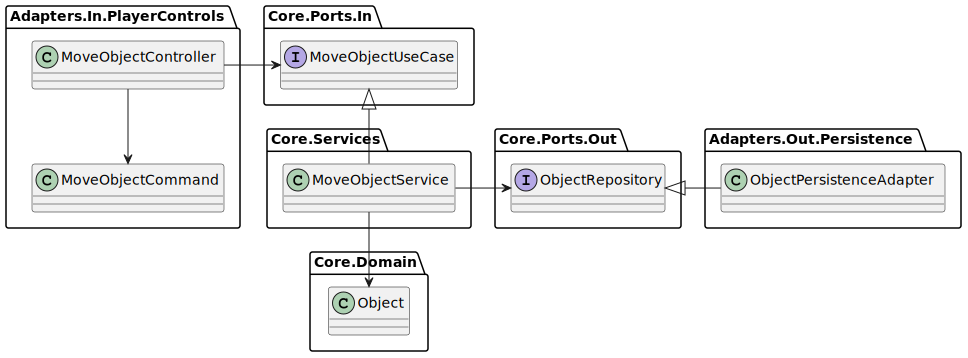

# Toy Robot

This project aims to solve and provide a demo application for [Toy Robot Code Challenge](ToyRobot.md).  

## Project Structure

This code challenge can be interpreted as a client-server game - with focus on the server side.  
The project was structured with extensibility in mind allowing future features (such as networking)  
and use cases to be implemented with less changes to the domain logic. 

The following shows how the project was organized, taking inspiration from the
[Hexagonal Architecture](https://en.wikipedia.org/wiki/Hexagonal_architecture_(software)) (Ports and Adapters)

[Source](src/)  
* [GameServer](src/GameServer)  
  * [Core](src/GameServer/Core)  
    * [Domain](src/GameServer/Core/Domain)  
    Contains the domain entities such as `Robot`(`Object`) and `Map` (in this case, a Table)  
    which are accessed by the use cases.  
    * [Services](src/GameServer/Core/Services)  
    Contains the implementation of the core use cases as services like  
    services for moving the `Robot` in the `Map`.  
    * [Ports](src/GameServer/Core/Ports)  
    Contains definition of ports (input and output ports) that allow communication  
    between the core and adapters.  
  * [Adapters](src/GameServer/Adapters)  
  Contains implementation of input adapters that executes the core use cases  
  and output adapters used by the core.  

* [DemoApplication](DemoApplication.md)  
Wires the components together to run a game server instance  
and provides a console application to simulate how a client might interact with the server.  

To illustrate the architecture, here is an example of the communication flow:  
***  
  

Figure 1 - The controller calls an incoming port, which is implemented by a service.  
The service calls an outgoing port, which is implemented by an adapter.  
Within the service, an entity is manipulated to perform a use case.  

  

***  

## How to Use

Please have a look at the [quick start guide](QuickStart.md).

## Roadmap

- [x] Implement core features
- [x] Implement incoming and outgoing adapters
- [x] Implement demo console application
- [ ] Implement unit tests
- [x] Implement ci/cd scripts

Future Plans
- [ ] Implement incoming adapters for admin controls
- [ ] Implement network/messaging capabilities for the game server's incoming port
- [ ] Implement a game client that can communicate with the server
